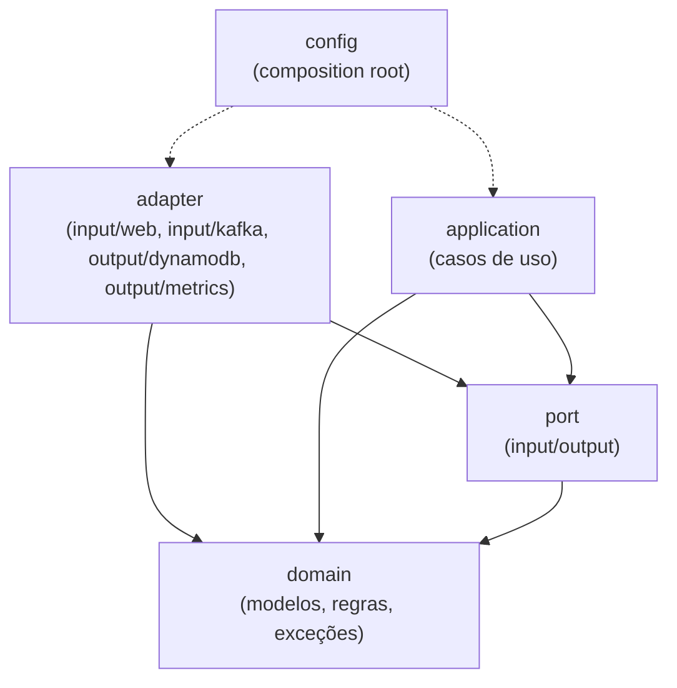
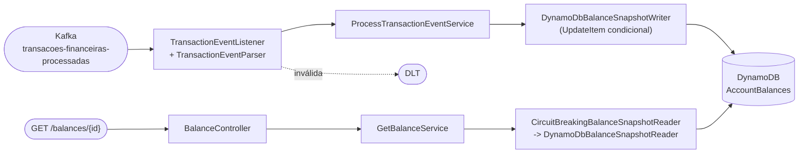

# Consulta de Saldo

[](../../actions/workflows/build.yml)
[](../../actions/workflows/test.yml)
[](../../actions/workflows/docker.yml)
[](../../actions/workflows/codeql.yml)

Serviço (Kotlin, Spring Boot 4, DynamoDB e Kafka) que mantém, por conta, o **snapshot de saldo da transação mais recente** recebida por
eventos e o expõe em `GET /balances/{accountId}`. A corretude não depende de ordem, unicidade nem de uma única instância: o serviço
converge para o mesmo saldo com eventos fora de ordem, duplicados, reentregues ou processados em paralelo.

O desenho foi conduzido por especificação (GitHub Spec Kit): tudo o que foi decidido, e por quê, está versionado em
[`specs/001-consulta-saldo/`](specs/001-consulta-saldo/) (spec, plano, pesquisa, contratos, tarefas) e nos
[15 ADRs](#decisões-de-arquitetura-adrs).

Siglas usadas neste repositório: **FR-xxx** são os requisitos funcionais e **SC-xxx** os critérios de sucesso mensuráveis, ambos
numerados em [`spec.md`](specs/001-consulta-saldo/spec.md); a **Constitution** são os princípios do projeto (arquitetura hexagonal,
corretude sob concorrência, resiliência, testes etc.) em [`.specify/memory/constitution.md`](.specify/memory/constitution.md).

## Sumário

- [Avaliação em 10 minutos](#avaliação-em-10-minutos)
- [Como rodar](#como-rodar)
- [Como testar](#como-testar)
- [API](#api)
- [Mensageria Kafka](#mensageria-kafka)
- [Arquitetura hexagonal](#arquitetura-hexagonal)
- [Modelagem no DynamoDB](#modelagem-no-dynamodb)
- [Concorrência e ordem](#concorrência-e-ordem)
- [Resiliência](#resiliência)
- [Observabilidade e operação](#observabilidade-e-operação)
- [Configuração](#configuração)
- [Rodando na AWS](#rodando-na-aws)
- [Interpretações do enunciado](#interpretações-do-enunciado)
- [Decisões de arquitetura (ADRs)](#decisões-de-arquitetura-adrs)
- [O que NÃO foi feito e por quê](#o-que-não-foi-feito-e-por-quê)
- [Riscos conhecidos e o que não foi verificado](#riscos-conhecidos-e-o-que-não-foi-verificado)
- [Uso de IA](#uso-de-ia)
- [Stack e imagens Docker](#stack-e-imagens-docker)

## Avaliação em 10 minutos

Pré-requisitos: **Docker** (com Docker Compose) e `make` (no Windows, use o WSL2). `make up` e `make test` só precisam disso.
`make integration-test`, `make perf-test` e `./gradlew` executam o Gradle no host e exigem também **JDK 21** (Temurin recomendado).

```bash
make up                                                        # app + DynamoDB Local + Redpanda + seeds (a 1a vez baixa as imagens)
make balance-get ACCOUNT=5b19c8b6-0cc4-4c72-a989-0c2ee15fa975  # 200 com a conta de exemplo do seed
make kafka-produce-scenario                                    # desordem, duplicata, empate, DISABLED, inválidas, veneno binário
make balance-get ACCOUNT=00000000-0000-4000-8001-000000000001  # 300.00 (o script imprime o resultado esperado de cada conta)
curl -s localhost:8082/actuator/health/readiness               # {"status":"UP"}
make stop                                                      # derruba tudo
```

Para ver o comportamento sob falha do armazenamento: `make chaos-dynamodb-pause`, consulte uma conta (503 em ~1,3 s, com
`Retry-After: 10`; a readiness continua 200) e `make chaos-dynamodb-unpause` (o consumer retoma sozinho, sem perda). O roteiro completo, com
o resultado esperado de cada passo, está em [`quickstart.md`](specs/001-consulta-saldo/quickstart.md).

## Como rodar

```bash
make up      # sobe tudo em background; o app só inicia depois que a tabela e os tópicos existem (seeds concluídos)
make logs    # logs JSON do app
make stop    # derruba tudo (apenas os containers deste projeto)
make help    # todos os alvos
```

| Serviço | Endereço | Observação |
|-|-|-|
| API | http://localhost:8080 | `GET /balances/{accountId}`, `GET /openapi.yaml` |
| Gerenciamento (Actuator) | http://localhost:8082 | saúde e métricas; **não rotear pelo balanceador público** |
| DynamoDB Local | http://localhost:8000 | modo in-memory |
| DynamoDB Admin | http://localhost:8001 | inspeção da tabela |
| Redpanda Console | http://localhost:8081 | inspeção de tópicos e do DLT |
| Redpanda (Kafka) | localhost:19092 | listener externo |

Alvos úteis:

| Alvo | O que faz |
|-|-|
| `make balance-get ACCOUNT=<uuid>` | Consulta um saldo (valida o formato do UUID antes de chamar) |
| `make kafka-produce-scenario` | Publica o cenário determinístico e imprime os resultados esperados |
| `make kafka-produce-transactions-events TOPIC=<t> COUNT=n` | Gera `n` eventos aleatórios |
| `make kafka-consume TOPIC=<t>` | Lê um tópico (ex.: `transacoes-financeiras-processadas.DLT`) |
| `make db-scan` | Lista os itens da tabela `AccountBalances` |
| `make chaos-dynamodb-pause` / `chaos-dynamodb-unpause` | Congela e retoma o DynamoDB Local |
| `make load-test` | Teste de carga k6 da consulta (500 req/s por 60 s; ver "Teste de carga" em [Como testar](#como-testar)); exige `make up` |
| `make http` | Executa `http/*.http` contra o app (via Docker) |
| `make clean-containers` | Remove todos os containers deste projeto, inclusive órfãos |

**Alvos herdados do starter (mantidos intactos):**

- `make kafka-topic-create NAME=<t>` **não deve ser usado para os tópicos deste serviço.** `transacoes-financeiras-processadas`
  (12 partições) e `transacoes-financeiras-processadas.DLT` (3 partições, retenção de 14 dias) já são criados pelo `redpanda-seed` em
  `make up` e `make kafka-up`. Rodar o alvo depois disso retorna erro de tópico já existente (esperado, sem efeito sobre o tópico).
  Rodar **antes** do seed criaria o tópico com 1 partição, porque o default do alvo é `PARTITIONS ?= 1` no `Makefile`, e o seed
  então o encontraria existente e não o corrigiria.
- `make kafka-produce-accounts-events` também é material do starter: gera eventos só com `account` (sem `transaction`), que o serviço
  rejeita e envia ao DLT com o motivo `missing_field`. Para gerar eventos do desafio use `make kafka-produce-transactions-events` ou
  `make kafka-produce-scenario`.

**Desenvolvimento pela IDE:** `make db-up kafka-up wait-seeds` sobe só a infraestrutura e espera os seeds; depois rode
`Application.kt` ou `./gradlew bootRun` (os defaults do `application.yaml` já apontam para `localhost`).

**Problemas comuns:** `port is already allocated` (a stack usa 8080, 8082, 8000, 8001, 8081 e 19092); a primeira subida baixa
~6 imagens; se algo ficar inconsistente, `make clean-containers` recomeça do zero.

## Como testar

| Comando | O que roda | Infraestrutura |
|-|-|-|
| `./gradlew check` | Testes unitários (413), teste de arquitetura Konsist, propriedade de convergência e **gate JaCoCo >= 90%** (hoje 97,1%) | Nenhuma (o contexto Spring de teste sobe sem broker nem banco) |
| `make test` | O mesmo `check`, dentro de um container (estágio `test` do Dockerfile), como no CI | Só Docker |
| `make integration-test` | Testes de integração **funcionais** contra DynamoDB Local e Redpanda **reais** (é o que o CI executa): ingestão ponta a ponta, concorrência real (32 threads na mesma conta), DLT por motivo, indisponibilidade do armazenamento, métricas e saúde, reinício gracioso. **Exclui** os testes com `@Tag("perf")` | Compose (sobe e espera os seeds; sempre reexecuta) |
| `make perf-test` | Só os testes de **performance** (`@Tag("perf")`): o p99 da ingestão com mensagens inválidas intercaladas deve ficar em no máximo 1,10x o baseline (SC-006). Sensível a ruído: rode numa máquina ociosa; não roda no CI | Compose (igual ao `integration-test`) |

`make test` e `make load-test` só precisam de Docker; `make integration-test`, `make perf-test` e `./gradlew check` rodam o Gradle no
host e exigem **JDK 21** (Temurin recomendado; o build declara a toolchain Java 21).

A asserção de latência relativa do SC-006 (p99 com inválidas <= 1,10x o baseline) é um teste de performance e fica fora do gate
funcional: num runner compartilhado de 2 vCPUs o mesmo código mediu 1,54x, contra 0,9x a 1,0x localmente. O limite não foi
afrouxado; o que o SC-006 tem de determinístico (as válidas nunca são retidas e só as inválidas vão ao DLT) segue no
`make integration-test` ([ADR-0014](docs/adr/0014-estrategia-de-testes-e-evidencia-de-corretude.md), item 8).

Pontos que sustentam a confiança na corretude (detalhes no [ADR-0014](docs/adr/0014-estrategia-de-testes-e-evidencia-de-corretude.md)):

- **TDD com evidência de vermelho**: os testes de integração escritos depois do código foram verificados por mutação temporária
  (por exemplo, trocar a condição da escrita por `>` ou por "último a chegar vence") e o resultado consta nas notas de execução do
  [`tasks.md`](specs/001-consulta-saldo/tasks.md).
- **Teste de propriedade** de convergência (kotest-property): qualquer ordem, duplicata ou entrega repetida converge para o evento
  de maior precedência; o teste é reexecutado contra o DynamoDB Local e prova que **detecta** uma implementação ingênua
  (last-write-wins).
- **Teste de contrato** do writer: o mesmo conjunto de casos roda contra o fake em memória e contra o DynamoDB Local.
- **Konsist** em todo commit: domínio puro, `application` só com domínio, portas e `@Service`, adapters isolados por tecnologia,
  ninguém depende de `config`, nenhum `catch` engole exceção sem log, métrica ou `throw`.
- **Teste anti-drift do OpenAPI** contra as respostas reais e **teste de privacidade de logs** com valores sentinela.
- O caos usa `docker compose pause dynamodb` (o teste sempre desfaz o `pause`).

### Teste de carga (SC-001)

`make load-test` roda o k6 (`grafana/k6:2.3.0`, via Docker) contra `GET /balances/{accountId}` com o script
[`perf/k6-balance-read.js`](perf/k6-balance-read.js): publica 200 eventos (uma conta nova por evento), coleta os ids no DynamoDB e
mede **500 req/s por 60 s** (mais 10 s de aquecimento fora dos limiares) sobre a conta de exemplo e essas contas. Os limiares
são os do SC-001 e não foram afrouxados: `p(50) < 50 ms` e `p(99) < 300 ms`, além de taxa de erro < 0,1% e nenhuma iteração
descartada (a taxa pedida foi de fato oferecida). Variáveis: `LOAD_RATE`, `LOAD_DURATION`, `LOAD_ACCOUNTS`.

Resultado medido (4 execuções em 2026-09-29, fase `steady`, ~30.000 requisições cada, 201 contas, todas as respostas 200 com o
`id` conferido no corpo):

| Execução | req/s | p50 | p95 | p99 | máximo | Erros |
|-|-|-|-|-|-|-|
| 1 | 500 | 0,94 ms | 1,20 ms | 2,02 ms | 20,7 ms | 0 |
| 2 | 500 | 0,99 ms | 1,21 ms | 1,85 ms | 8,5 ms | 18 de 30.001 (0,06%): `dial: i/o timeout` no gerador; não chegaram ao app |
| 3 | 500 | 1,03 ms | 1,24 ms | 2,28 ms | 6,9 ms | 0 |
| 4 | 500 | 1,00 ms | 1,19 ms | 2,07 ms | 46,8 ms | 0 |

Todos os limiares passaram, com margem de ~50x no p50 e de ~130x no p99. A medição do lado do servidor concorda: o histograma
`http_server_requests` deu média de ~0,5 ms e `balance_store_read_duration_seconds` ~0,4 ms por leitura, e o total de requisições do
app fechou igual ao do k6 (menos as 18 falhas de conexão da execução 2).

**Premissa de carga.** 1.000 eventos/s na ingestão e 500 consultas/s, com múltiplas instâncias, são **premissas do autor**: o
enunciado não fixa volume. Elas dimensionam as 12 partições e a leitura on-demand e dão sentido aos critérios SC-001 e SC-002; não
são um requisito do cliente.

**Ressalva: é ambiente local e não representa a AWS.** Docker Desktop (VM com 10 CPUs e 8 GB) com o app, o DynamoDB Local (em
memória), o Redpanda e o k6 na mesma máquina, tráfego pelo `host.docker.internal`, uma única instância do app e sem ingestão
concorrente. O DynamoDB real tem latência de rede e de armazenamento maiores, throttling e particionamento que o DynamoDB Local
não reproduz. O resultado prova que o caminho da consulta (Tomcat, serviço, mapeamento, cliente do SDK e circuit breaker) não
introduz custo relevante e que a taxa de 500 req/s é sustentada por uma instância; não prova o SLO na AWS.

## API

`GET /balances/{accountId}` (contrato completo em [`openapi.yaml`](specs/001-consulta-saldo/contracts/openapi.yaml), também servido em
`GET /openapi.yaml`).

```bash
curl -i localhost:8080/balances/5b19c8b6-0cc4-4c72-a989-0c2ee15fa975
```

```json
{"id":"5b19c8b6-0cc4-4c72-a989-0c2ee15fa975","owner":"315e3cfe-f4af-4cd2-b298-a449e614349a","balance":{"amount":183.12,"currency":"BRL"},"updated_at":"2025-07-05T18:04:13.433-03:00"}
```

- O saldo é um número JSON **exato** (nunca `double`, nunca arredondado, sem notação científica). A escala é completada às casas da
  moeda na resposta (`183.1` vira `183.10`; `10.123` permanece `10.123`).
- `updated_at` é o instante do **evento** que originou o snapshot (não o do processamento), com microssegundos e offset de
  `America/Sao_Paulo` (configurável). A fração de segundo não tem zeros à direita (`.433`, `.433123`, `.43`) e some quando é zero;
  ver [Interpretações do enunciado](#interpretações-do-enunciado).
- Respostas de erro em `application/problem+json` (RFC 9457) com `type` estável, sem pilha nem nomes de infraestrutura:

| Situação | Status | `type` (`urn:problem-type:consulta-saldo:...`) |
|-|-|-|
| `accountId` não é UUID canônico (`abc`, `1-1-1-1-1`) | 400 | `requisicao-invalida` (o banco nem é consultado) |
| Conta sem nenhum evento processado | 404 | `conta-nao-encontrada` (nunca saldo zerado) |
| Conta cujo snapshot vigente é `DISABLED` | 409 | `conta-desabilitada` (sem saldo nem titular no corpo) |
| Armazenamento indisponível, lento ou circuit breaker aberto | 503 | `servico-indisponivel` + `Retry-After: 10` |
| Falha interna (inclui item corrompido no banco) | 500 | `erro-interno` (detalhe só no log) |

- `X-Correlation-Id` (`[A-Za-z0-9._-]{1,64}`) é aceito ou gerado, devolvido em toda resposta e presente nos logs.
- A leitura é **fortemente consistente** por padrão ([ADR-0011](docs/adr/0011-leitura-fortemente-consistente.md)); a falha de leitura
  nunca vira 404 nem saldo presumido.

## Mensageria Kafka

| Tópico | Papel | Partições |
|-|-|-|
| `transacoes-financeiras-processadas` | Entrada: um evento de transação com o estado da conta; mensagens sem chave, **nenhuma ordem assumida** | 12 |
| `transacoes-financeiras-processadas.DLT` | Isolamento de mensagens inválidas (retenção de 14 dias) | 3 |

- **At-least-once**: o container só confirma o offset depois que o listener persistiu; sem auto-commit. A idempotência vem da escrita
  condicional no banco. O consumer trabalha sobre bytes verbatim (`ByteArrayDeserializer`) e valida com um parser estrito.
- **Mensagem inválida vai para o DLT** com o valor original intacto (inclusive binário) e os headers `x-rejection-reason`,
  `x-rejection-detail` (só o caminho do campo, nunca valores) e `x-rejected-at`. Motivos (conjunto fechado):
  `malformed_payload`, `missing_field`, `invalid_identifier`, `invalid_value`, `invalid_currency`, `invalid_timestamp`,
  `unknown_domain_value` e, para defeito interno, `unprocessable_event`. Os headers de exceção do Spring são excluídos de propósito
  (mensagens de parser poderiam vazar saldo ou titular).
- **Falha do armazenamento nunca manda mensagem válida ao DLT**: a mensagem fica no broker e o consumer aplica backpressure.
- **Reprocessamento do DLT é manual** nesta versão; o roteiro está em
  [`kafka-events.md`](specs/001-consulta-saldo/contracts/kafka-events.md) (seção 7). O contrato do evento:
  [`transaction-event.schema.json`](specs/001-consulta-saldo/contracts/transaction-event.schema.json).

## Arquitetura hexagonal

O núcleo (`domain`) não conhece Spring, AWS, Kafka nem Jackson. Tudo que é externo entra por **portas** implementadas por
**adapters**; as dependências apontam sempre para o domínio. A regra é **verificada por teste** (Konsist), não por convenção
([ADR-0001](docs/adr/0001-arquitetura-hexagonal-por-bounded-context.md)).





Código em `src/main/kotlin/br/com/itau/challenge/balance/`:

| Camada | Conteúdo |
|-|-|
| `domain` | `Money` (BigDecimal exato), `EventInstant` (µs), `Precedence` (timestamp, txId), `BalanceSnapshot`, `TransactionEvent`, identificadores canônicos, `RejectionReason`, exceções |
| `port` | `GetBalanceUseCase`, `ProcessTransactionEventUseCase` (entrada); `BalanceSnapshotReader`, `BalanceSnapshotWriter`, `OutcomeMetrics`, `ConsumerFailureMetrics`, `IngestMetrics` (saída) |
| `application` | `GetBalanceService` (regra de conta desabilitada), `ProcessTransactionEventService` (tolerância de futuro, desfecho único), `FutureTolerance` |
| `adapter/input/web` | `BalanceController`, `ProblemDetailsAdvice`, `CorrelationIdFilter`, `OpenApiController` |
| `adapter/input/kafka` | `TransactionEventListener`, `TransactionEventParser` (estrito), `DeadLetterConfig`, `DeadLetterRetryListener`, `FailureBackOffs`, `BackpressureConfig`, `FailureClassifier` |
| `adapter/output/dynamodb` | Reader e writer, `BalanceItemMapper`, clientes separados, `CircuitBreakingBalanceSnapshotReader`, `DynamoDbHealthIndicator` |
| `adapter/output/metrics` | `MicrometerProcessingMetrics` |
| `config` | Composition root: `PersistenceConfig`, `TimeConfig`, `EventParsingConfig`, `ResilienceConfig` e `BalanceProperties` |

Outros diretórios: `src/test` (unitários), `src/integrationTest` (infra real), `infra/` (seeds e scripts do compose), `http/`
(exemplos), `docs/adr/`, `docs/metodologia-ia.md`, `specs/` e `.specify/` (artefatos do Spec Kit).

## Modelagem no DynamoDB

Tabela única `AccountBalances`, on-demand, **um item por conta** com o snapshot vigente ([ADR-0002](docs/adr/0002-modelagem-dynamodb-snapshot-por-conta.md)):

| Atributo | Tipo | Conteúdo |
|-|-|-|
| `pk` (partition key) | S | `ACCOUNT#<accountId em minúsculas>` |
| `sk` (sort key) | S | constante `BALANCE` |
| `schemaVersion`, `ownerId`, `accountStatus`, `balanceCurrency` | N / S | dados do snapshot |
| `balanceAmount` | **N** | saldo exato (`BigDecimal.toPlainString()`, até 38 dígitos) |
| `accountCreatedAtMicros` | N | criação da conta (µs) |
| `lastTxTsMicros` + `lastTxId` | N + S | **chave de precedência** do evento que originou o snapshot |

- **Padrões de acesso**: (AP1) leitura por `GetItem` na chave primária, fortemente consistente; (AP2) escrita condicional por
  `UpdateItem` na mesma chave. Ambos são O(1) e atingem uma única partição por conta.
- **Por que o `sk` é constante**: o key schema é imutável; `pk`/`sk` genéricos permitem acrescentar outros tipos de item na
  partição da conta (por exemplo um ledger `TX#...`) sem migrar a tabela, com custo zero hoje.
- **Por que sem GSI**: não há padrão de acesso que o exija (só consulta por conta) e cada GSI multiplicaria o custo de escrita de
  cada evento. Uma consulta por titular seria um GSI esparso (`OWNER#<id>`), documentado como evolução.
- **Por que sem ledger**: o requisito é o saldo mais atual, não o histórico; um ledger dobraria a escrita, concentraria carga na
  partição da conta e não muda a corretude. Se surgir requisito de extrato, entra como item `TX#...` com TTL, em escrita
  independente e idempotente (nunca `TransactWriteItems`, que perderia o registro quando o snapshot fosse obsoleto).
- **Saldo como `N` e `BigDecimal`** (e não texto nem centavos inteiros): exatidão sem perda, comparável e sem assumir casas fixas
  ([ADR-0005](docs/adr/0005-representacao-de-dinheiro-e-tempo.md)).

## Concorrência e ordem

A pergunta é sempre a mesma: qual evento é o mais recente? A resposta é **determinística**, não depende de ordem de chegada nem do
relógio do servidor ([ADR-0003](docs/adr/0003-precedencia-deterministica-e-escrita-condicional-atomica.md)):

- **Precedência** = `(transaction.timestamp em µs, transaction.id)`; no empate de instante vence o maior `transaction.id`
  (comparação lexicográfica da string canônica em minúsculas, a mesma ordem que o banco usa).
- **Uma única `UpdateItem` por evento**, decidida pelo próprio DynamoDB:
  `attribute_not_exists(pk) OR lastTxTsMicros < :ts OR (lastTxTsMicros = :ts AND lastTxId < :tx)`. Sem leitura-modificação-escrita,
  sem lock local, sem transação: instâncias e threads concorrentes são arbitradas pelo banco, e a consulta nunca vê campos de
  eventos diferentes misturados (o item é atômico).
- **Duplicado x obsoleto** ([ADR-0004](docs/adr/0004-classificacao-de-desfechos-duplicado-versus-obsoleto.md)): o `ConditionalCheckFailed`
  não é erro; o item vigente vem na própria exceção (`ALL_OLD`) e classifica: chave igual = `duplicate`; precedência menor =
  `obsolete`. Mesma chave com conteúdo divergente é a anomalia `conflicting_duplicate` (defeito da origem; prevalece o primeiro e
  o contador `balance.events.anomalies` alerta).
- **Transações `DECLINED` participam da precedência**: o evento carrega o estado da conta naquele instante, e o snapshot mais
  recente é o que vale.
- **Conta `DISABLED`**: o snapshot é atualizado normalmente, mas a consulta responde 409 `conta-desabilitada`; um evento antigo não
  a reabilita e um evento mais novo com `ENABLED` sim.
- **Tolerância de timestamp futuro** configurável (`BALANCE_FUTURE_TOLERANCE`, 5 min): o relógio só valida, nunca decide precedência.
- **Custo conhecido**: um evento obsoleto ainda consome 1 WCU (a condição falsa é cobrada). Mitigação futura: coalescência por conta.

## Resiliência

| Mecanismo | O que faz | Onde |
|-|-|-|
| **DLT** | Mensagem inválida vai ao DLT com o motivo, valor original preservado; DLT fora = não confirma o offset (reentrega), nunca perde | [ADR-0008](docs/adr/0008-erros-transitorios-permanentes-backpressure-e-dlt.md) |
| **Backpressure** | Falha transitória do armazenamento (indisponível, throttling, timeout): backoff exponencial 500 ms x2 até 30 s com jitter, sem limite de tentativas, container **pausado** entre tentativas (o container pai: todas as threads de consumo da instância; o poll continua vivo, sem rebalance); a mensagem fica no broker e **nunca** vai ao DLT | idem |
| **Uma camada de retry por chamada** | Escrita: só o error handler do consumer (o SDK não tenta de novo). Leitura: só o SDK (1 retry). Nunca retry multiplicado | [ADR-0009](docs/adr/0009-uma-camada-de-retry-e-clientes-dynamodb-separados.md) |
| **Clientes DynamoDB separados** | Timeouts, retry e pools próprios para leitura (API) e escrita (consumer): uma rajada de ingestão não esgota as conexões da consulta | idem |
| **Circuit breaker na leitura** | Resilience4j programático: com o banco doente a API responde 503 + `Retry-After` em milissegundos em vez de acumular chamadas lentas | [ADR-0010](docs/adr/0010-circuit-breaker-na-leitura-com-resilience4j.md) |
| **Falha não classificada** | Defeito interno determinístico: 3 entregas e DLT `unprocessable_event`, para não bloquear a partição para sempre | ADR-0008 |
| **Encerramento gracioso** | `SIGTERM` -> termina o registro corrente, o que não foi persistido não é confirmado e é reentregue | [ADR-0013](docs/adr/0013-observabilidade.md), [ADR-0015](docs/adr/0015-empacotamento-e-operacao.md) |

Coberto por testes reais: 200 eventos publicados durante a indisponibilidade resultam em exatamente 200 itens depois do
`unpause` (0 perdas, 0 no DLT); 20 consultas sucessivas com o banco congelado respondem 503 em ~1,3 s cada, nunca 404 nem saldo antigo.

## Observabilidade e operação

**Duas portas, propositalmente:**

| Porta | Conteúdo | Exposição |
|-|-|-|
| **8080** | API (`/balances/{id}`, `/openapi.yaml`) | Pública |
| **8082** | Actuator: `health` e `prometheus` | **Não deve ser roteada pelo balanceador público** (proteção do endpoint é do gateway/rede); o compose local a publica por conveniência |

**Saúde** ([ADR-0013](docs/adr/0013-observabilidade.md)):

| Endpoint (porta 8082) | Significado |
|-|-|
| `/actuator/health/liveness` | Só o estado do processo. Permanece `UP` com o DynamoDB fora. É o `HEALTHCHECK` da imagem |
| `/actuator/health/readiness` | Só a capacidade do próprio processo. **Permanece `UP` com o DynamoDB fora**: a dependência é compartilhada, e derrubar a readiness tiraria todas as instâncias da rotação ao mesmo tempo, impedindo o 503 rápido com `Retry-After` |
| `/actuator/health/dependencies` | Sonda do DynamoDB (`DescribeTable`, cache de 5 s). Vira 503 quando o banco falha; serve a operação e o alerta, não o balanceador |
| `/actuator/health` (raiz) | **Não usar como sonda**: agrega as dependências e fica 503 com o DynamoDB fora, o que retiraria todas as instâncias |

**Métricas** (`/actuator/prometheus`, contrato em [`observability.md`](specs/001-consulta-saldo/contracts/observability.md)):

- `balance_events_total{outcome,reason}`: **exatamente um desfecho por mensagem** (`processed`, `obsolete`, `duplicate`, `rejected`);
  a soma reconcilia com o número de mensagens consumidas.
- Latência com histograma (agregável com `histogram_quantile`): `http_server_requests`, `balance_ingest_duration`,
  `balance_store_read_duration`, `balance_store_write_duration`. O timer `balance_ingest_duration` é **por entrega**, não por mensagem:
  uma mensagem reentregue (falha transitória) gera uma amostra a cada tentativa, com `outcome="error"` nas que falham.
- Sinais de alerta: `balance_dlt_publish_failures_total > 0`, `balance_events_total{reason="unprocessable_event"}`,
  `balance_store_read_corrupted_total`, `balance_consumer_backpressure_total`, `balance_dependency_up{dependency="dynamodb"} == 0`,
  estado do circuit breaker (`resilience4j_circuitbreaker_state{name="dynamodb-read"}`) e lag do consumer.

**Logs** JSON estruturados com `correlationId`, `accountId` e `transactionId` no MDC. **Nunca** saldo, titular, payload nem
mensagem de parser (teste de privacidade com valores sentinela). Com o circuit breaker aberto, cada rejeição de leitura loga em
DEBUG (sem pilha); o WARN sai só na **transição** de estado do breaker e nas falhas reais de leitura, para que uma rajada de 503 não
gere uma linha de WARN por requisição. Tracing distribuído não foi implementado (ver abaixo).

**Imagem** ([ADR-0015](docs/adr/0015-empacotamento-e-operacao.md)): não-root (uid 10001), heap relativa à memória do container
(`-XX:MaxRAMPercentage=75 -XX:+ExitOnOutOfMemoryError` no `ENTRYPOINT`, não em `JAVA_TOOL_OPTIONS`, cuja linha de aviso da JVM não é JSON), `HEALTHCHECK` na liveness, `ENTRYPOINT` em exec form (a JVM recebe o `SIGTERM`),
tags fixas do Temurin (`21.0.12_8-*-noble`), que exigem rotina periódica de atualização.

## Configuração

Tudo por variáveis de ambiente com defaults para o ambiente local; o compose sobrescreve os hosts. Lista completa e descrição em
[`contracts/configuration.md`](specs/001-consulta-saldo/contracts/configuration.md). As principais:

| Variável | Padrão | Descrição |
|-|-|-|
| `SERVER_PORT` / `MANAGEMENT_SERVER_PORT` | `8080` / `8082` | Portas da API e do Actuator |
| `DYNAMODB_ENDPOINT` | `http://localhost:8000` | Em produção, **vazio** para usar o endpoint AWS e a cadeia padrão de credenciais |
| `DYNAMODB_REGION` / `BALANCE_TABLE_NAME` | `us-east-1` / `AccountBalances` | Região e tabela |
| `DYNAMODB_READ_CONSISTENT` | `true` | Leitura fortemente consistente (custo 2x, ADR-0011) |
| `KAFKA_BOOTSTRAP_SERVERS` | `localhost:19092` | Brokers |
| `BALANCE_EVENTS_TOPIC` / `BALANCE_EVENTS_DLT_TOPIC` | `transacoes-financeiras-processadas` / `<tópico>.DLT` | Tópicos |
| `KAFKA_CONSUMER_GROUP_ID` / `KAFKA_LISTENER_CONCURRENCY` | `consulta-saldo` / `4` | Grupo e threads (total entre instâncias <= partições) |
| `KAFKA_BACKOFF_INITIAL_MS` / `_MAX_MS` / `_JITTER_MS` | `500` / `30000` / `250` | Backoff da falha transitória |
| `BALANCE_FUTURE_TOLERANCE` | `PT5M` | Tolerância de timestamp futuro |
| `BALANCE_CB_*` | ver contrato | Janela, mínimo de chamadas, taxas e espera do circuit breaker |
| `LOGGING_STRUCTURED_FORMAT_CONSOLE` | `logstash` | Logs JSON |

## Rodando na AWS

O compose é só para desenvolvimento local. Esta seção é o que precisa ser conhecido para levar a imagem a um ambiente AWS; a
infraestrutura como código (Terraform/CDK) está **fora do escopo** deste repositório. A lista completa de variáveis está em
[`contracts/configuration.md`](specs/001-consulta-saldo/contracts/configuration.md).

**Pré-requisitos do ambiente (criados antes de subir o serviço):**

- A tabela DynamoDB (`BALANCE_TABLE_NAME`, padrão `AccountBalances`; chave `pk`/`sk`, ambas `S`, on-demand) e os tópicos Kafka de
  entrada e do DLT. O serviço **não** cria tabela nem tópico; a auto-criação de tópicos está desligada no broker local
  (`infra/redpanda/config.sh`) e o app nunca chama `CreateTable`. Referência de criação: `infra/dynamodb/seed.sh` e
  `infra/redpanda/seed.sh` (12 partições na entrada, 3 no DLT).
- Variáveis obrigatórias fora do ambiente local, porque o default do `application.yaml` aponta para `localhost`:
  `KAFKA_BOOTSTRAP_SERVERS`, `DYNAMODB_REGION`, `BALANCE_TABLE_NAME` (se diferente do padrão) e `DYNAMODB_ENDPOINT` **definida e
  vazia** (ver a armadilha abaixo).

**Credencial, endpoint e região do DynamoDB (comportamento real de `DynamoDbClientsConfig`, herdado do starter e não alterado):**

| `DYNAMODB_ENDPOINT` | O que o serviço faz |
|-|-|
| não definida | cai no default `http://localhost:8000` e usa a credencial estática `local`/`local` |
| com valor | `endpointOverride` para esse endereço e credencial estática `local`/`local` (nunca a da AWS) |
| definida e **vazia** (`DYNAMODB_ENDPOINT=`) | endpoint AWS da região e *default credentials provider chain* (variáveis de ambiente, perfil, role da tarefa/pod, IMDS) |

- **Risco**: esquecer de definir a variável vazia faz o serviço tentar `localhost:8000` com credencial falsa, em vez de falhar na
  partida com uma mensagem clara. O sintoma é o `503` na leitura e o `backpressure` na ingestão, com `cause=misconfigured` ou
  `unavailable` (ver o diagnóstico abaixo).
- `DYNAMODB_REGION` (padrão `us-east-1`) **não herda `AWS_REGION`**: a região do cliente vem só dessa variável.
- **Evolução registrada**: a credencial local passar a depender de uma flag explícita (por exemplo `DYNAMODB_LOCAL=true`), a região
  seguir a cadeia padrão do SDK e um `warn` na partida quando o endpoint for local. Não foi feito porque `DynamoDbClientsConfig`
  é o trecho do starter que se decidiu manter, apenas documentado.

**Política IAM mínima**, com as ações que o código realmente chama (`DynamoDbBalanceSnapshotReader`, `DynamoDbBalanceSnapshotWriter`,
`DynamoDbHealthIndicator`), restrita à tabela:

```json
{
  "Effect": "Allow",
  "Action": ["dynamodb:GetItem", "dynamodb:UpdateItem", "dynamodb:DescribeTable"],
  "Resource": "arn:aws:dynamodb:<regiao>:<conta>:table/AccountBalances"
}
```

`GetItem` atende a consulta e o caminho raro do writer; `UpdateItem` é a escrita condicional. **`DescribeTable` é do health
indicator**: sem ele o probe falha, o grupo `/actuator/health/dependencies` e o gauge `balance_dependency_up` ficam **DOWN em falso**
mesmo com a leitura e a escrita funcionando.

**Autenticação do Kafka.** O serviço só configura `KAFKA_BOOTSTRAP_SERVERS`. Para SASL/SSL use as propriedades do cliente por
variável de ambiente do Spring (`SPRING_KAFKA_PROPERTIES_SECURITY_PROTOCOL`, `SPRING_KAFKA_PROPERTIES_SASL_MECHANISM`,
`SPRING_KAFKA_PROPERTIES_SASL_JAAS_CONFIG` etc.), que valem para o consumer e para o produtor do DLT. **Não há a dependência
`aws-msk-iam-auth` no classpath**: MSK com IAM exigiria acrescentá-la, o que não foi feito nem testado; SASL/SCRAM ou mTLS só dependem
de configuração. Nenhuma dessas variantes foi exercitada neste repositório (o broker local é sem autenticação).

**Encerramento.** `server.shutdown=graceful` com `spring.lifecycle.timeout-per-shutdown-phase=30s`: os 30 s valem **por fase** do
ciclo de vida (o servidor web e o container Kafka são fases distintas), então o tempo total pode passar de 30 s. Recomendação:
`terminationGracePeriodSeconds` >= 60 s (o compose local usa `stop_grace_period: 40s`) e, atrás de balanceador, um `preStop` curto e o
*deregistration delay* do alvo, para que a instância deixe de receber tráfego antes do `SIGTERM`.

**Rede.** A porta 8082 (Actuator: `health` e `prometheus`) **não deve ser roteada publicamente**: só a 8080 vai ao balanceador; a
8082 fica para a sonda do orquestrador, o *scrape* do Prometheus e a operação. Use `/actuator/health/liveness` e
`/actuator/health/readiness` como sondas, nunca a raiz.

**Diagnosticar configuração errada.** Tabela inexistente, acesso negado, credencial ausente, inválida ou expirada continuam sendo
tratadas como transitórias (reentrega sem limite, **nunca DLT**, a mensagem fica no broker), mas agora se distinguem de uma
indisponibilidade real: o contador `balance_consumer_backpressure_total{cause="misconfigured"}` cresce, e o log sai em **ERROR**
com a classe da exceção do SDK, o `errorCode` e o `statusCode` (nunca a mensagem livre nem o payload). Na leitura o resultado
é o mesmo `503`, também com ERROR no log. Alerte em `balance_consumer_backpressure_total{cause="misconfigured"}` (qualquer aumento).

## Interpretações do enunciado

Onde o enunciado é omisso ou ambíguo, o autor decidiu e registrou o porquê. Nenhuma dessas decisões vem do enunciado; todas podem
ser revertidas com mudança localizada. O registro formal está nas *Clarifications* da
[`spec.md`](specs/001-consulta-saldo/spec.md) e nos ADRs citados.

| Ponto | Decisão | Por quê e trade-off | Registro |
|-|-|-|-|
| Conta `DISABLED` | A consulta responde **409** `conta-desabilitada`, sem saldo nem titular | O enunciado só diz para retornar o saldo. Tratar conta desabilitada como erro explícito e distinto evita que um consumidor use um saldo de conta que não pode operar, e não confunde com "não encontrada". A alternativa (200 com o campo de status no corpo) obrigaria o contrato a expor `status` e cada consumidor a lembrar de checá-lo; o que mudaria é `GetBalanceService`, o `openapi.yaml` e o `type` `conta-desabilitada` | spec (*Clarifications*), FR-011, SC-013 |
| `updated_at` | É o instante do **evento** que originou o snapshot, não o do processamento | Torna o resultado determinístico e reprodutível em reprocessamentos e coerente com a regra de que o relógio do servidor nunca decide o estado. Custo: `updated_at` não mostra há quanto tempo o serviço recebeu o dado | spec (*Assumptions*), FR-022, [ADR-0005](docs/adr/0005-representacao-de-dinheiro-e-tempo.md) |
| Transação `DECLINED` | Participa da precedência e atualiza o snapshot | O evento carrega o estado da conta naquele instante; ignorar `DECLINED` deixaria `updated_at` e o saldo defasados de um evento mais recente. Custo: uma recusa de valor inalterado ainda consome uma escrita | spec (*Clarifications*), [ADR-0003](docs/adr/0003-precedencia-deterministica-e-escrita-condicional-atomica.md) |
| Timestamp no futuro | Tolerância de 5 min (`BALANCE_FUTURE_TOLERANCE`); além disso `invalid_timestamp` e DLT | Protege a precedência de um relógio de origem adiantado. Risco residual aceito: um evento até 5 min no futuro pode prevalecer sobre eventos legítimos mais antigos | spec (*Clarifications*), [ADR-0006](docs/adr/0006-validacao-estrita-e-catalogo-de-motivos.md) |
| Status de conta desconhecido | Rejeitado (`unknown_domain_value`) e isolado no DLT com o conteúdo preservado | Aceitar um valor não previsto arriscaria decidir errado entre 200 e 409; rejeitar preserva a mensagem para reprocessar quando o domínio for ampliado | spec (*Clarifications*), ADR-0006 |
| Formato de `updated_at` | ISO 8601 com offset de `America/Sao_Paulo` e fração **sem zeros à direita** (`.433`, `.433123`, `.43`; sem fração quando zero) | É a saída de `DateTimeFormatter.ISO_OFFSET_DATE_TIME`, válida em ISO 8601, e reproduz o exemplo do enunciado (`...13.433-03:00`). Um parser que exija **exatamente** 3 ou 6 dígitos precisa tolerar a fração variável. Padronizar a largura seria uma mudança de formato, deliberadamente não feita | [ADR-0005](docs/adr/0005-representacao-de-dinheiro-e-tempo.md), [`data-model.md`](specs/001-consulta-saldo/data-model.md) seção 5 |

## Decisões de arquitetura (ADRs)

Cada ADR tem contexto, decisão, alternativas e consequências.

| ADR | Decisão |
|-|-|
| [0001](docs/adr/0001-arquitetura-hexagonal-por-bounded-context.md) | Arquitetura hexagonal por bounded context, verificada por Konsist |
| [0002](docs/adr/0002-modelagem-dynamodb-snapshot-por-conta.md) | Snapshot por conta, `pk=ACCOUNT#id`/`sk=BALANCE`, sem GSI nem ledger |
| [0003](docs/adr/0003-precedencia-deterministica-e-escrita-condicional-atomica.md) | Precedência `(timestamp, txId)` e escrita condicional atômica |
| [0004](docs/adr/0004-classificacao-de-desfechos-duplicado-versus-obsoleto.md) | Duplicado x obsoleto pelo item antigo (`ALL_OLD`) e anomalia |
| [0005](docs/adr/0005-representacao-de-dinheiro-e-tempo.md) | `BigDecimal`/`N` para dinheiro, microssegundos para tempo |
| [0006](docs/adr/0006-validacao-estrita-e-catalogo-de-motivos.md) | Validação estrita e catálogo fechado de motivos |
| [0007](docs/adr/0007-consumer-kafka-at-least-once-e-particionamento.md) | Consumer at-least-once e particionamento |
| [0008](docs/adr/0008-erros-transitorios-permanentes-backpressure-e-dlt.md) | Erros transitórios x permanentes, backpressure e DLT |
| [0009](docs/adr/0009-uma-camada-de-retry-e-clientes-dynamodb-separados.md) | Uma camada de retry e clientes DynamoDB separados |
| [0010](docs/adr/0010-circuit-breaker-na-leitura-com-resilience4j.md) | Circuit breaker na leitura (Resilience4j programático) |
| [0011](docs/adr/0011-leitura-fortemente-consistente.md) | Leitura fortemente consistente |
| [0012](docs/adr/0012-api-problem-details-e-openapi-contract-first.md) | Problem Details e OpenAPI contract-first |
| [0013](docs/adr/0013-observabilidade.md) | Observabilidade: porta separada, saúde em grupos, logs JSON |
| [0014](docs/adr/0014-estrategia-de-testes-e-evidencia-de-corretude.md) | Estratégia de testes e evidência de corretude |
| [0015](docs/adr/0015-empacotamento-e-operacao.md) | Imagem não-root, heap relativa, healthcheck, tags fixas |

## O que NÃO foi feito e por quê

Cada item foi uma decisão consciente (escopo, custo, ausência de requisito), com o desenho proposto para quando o gatilho aparecer
([`research.md`](specs/001-consulta-saldo/research.md) R-17).

| Item | Por que não | Desenho proposto |
|-|-|-|
| Ledger de transações (`TX#` com TTL) | Dobra a escrita e concentra carga na partição da conta; o requisito é o saldo atual e a corretude independe dele | Duas escritas independentes e idempotentes (`PutItem` com `attribute_not_exists` + a `UpdateItem` do snapshot) |
| GSI por titular | Não há padrão de acesso; cada GSI soma WCU a cada evento | `gsi1pk=OWNER#id`, `gsi1sk=ACCOUNT#id`, índice esparso com projeção parcial |
| Write sharding / coalescência por conta | Sem contas quentes na carga assumida | Coalescência no lote de consumo (só o último evento por conta); gatilho: throttling ou muitos `obsolete` |
| Reprocessamento automático do DLT | A spec o define como manual nesta versão | Roteiro manual documentado; futuro `retry` controlado com limite |
| Tracing distribuído (OpenTelemetry) | O `correlationId` cobre a correlação nos logs e o autorizador não propaga `traceparent` | Habilitar o starter, amostragem e exportador OTLP; o MDC passa a receber `traceId`/`spanId` sem mudar o código |
| Prometheus/Grafana/alertas no compose | Não é requisito; as métricas estão expostas | Regras de alerta sugeridas acima |
| IaC (Terraform/CDK), PITR e deletion protection | Fora do escopo de um repositório de avaliação | Descritos em `data-model.md` 4.1 |
| Autenticação/autorização e rate limiting | Tratados no gateway/rede | Gateway na frente; a porta 8082 nunca pública |
| Schema Registry / Avro | O contrato JSON é imposto pelo produtor | n/a |
| Teste de mutação (PIT) e carga sustentada multi-instância | Tempo; sem gate no starter | O k6 já cobre a leitura em uma instância ([Teste de carga](#teste-de-carga-sc-001)); falta multi-instância, ingestão sob carga e AWS |
| Multi-região / global tables | Fora da carga assumida | A chave de precedência é determinística, então converge sem coordenação |

## Riscos conhecidos e o que não foi verificado

- **SC-001 verificado só em ambiente local.** O k6 (`make load-test`) sustentou 500 req/s por 60 s com p50 de ~1 ms e p99 de ~2 ms
  (limiares de 50 ms e 300 ms), mas contra DynamoDB Local, com o gerador na mesma máquina, uma instância e sem ingestão
  concorrente (ver [Teste de carga](#teste-de-carga-sc-001)). Não foram medidos a latência sobre a AWS real, a ingestão sustentada
  (~1.000 eventos/s) nem a leitura durante a ingestão; a ingestão só foi medida em pequena escala (<= 5 s por evento, SC-002, nos
  testes de integração).
- **DLT fora do ar**: a nova tentativa de publicar não tem backoff exponencial próprio (limitada por `max.block.ms` + timeout de
  envio, ~3-5 s) e o laço de reentrega ocupa a **thread de consumo inteira**, não só a partição da mensagem. Nada se perde; o sinal
  é `balance_dlt_publish_failures_total`.
- **Falha permanente do armazenamento tratada como transitória** (por exemplo tabela removida ou credencial expirada): a ingestão
  fica retida indefinidamente, sem perder mensagens; os sinais são `balance_consumer_backpressure_total` (com `cause="misconfigured"`
  para configuração e credencial) e `dependencies` em 503.
- **Custo de eventos obsoletos**: cada evento com condição falsa ainda consome 1 WCU.
- **Anomalia `conflicting_duplicate`** (mesma chave, conteúdo diferente) fica fora da garantia de convergência: vale o primeiro.
- **Tags fixas do Docker** congelam patches; sem a rotina de atualização a base envelhece.
- **DLT é at-least-once**: a publicação no DLT pode ser confirmada pelo broker e o offset de entrada não (queda entre os dois),
  gerando **duplicata no DLT**; `rejected` é contado depois da confirmação do DLT e pode, nesse caso, contar em dobro. A ordem
  inversa (perder a mensagem) não ocorre. A reconciliação por desfecho vale para o fluxo normal; uma duplicata no DLT é tolerada.
- **`/actuator/health` (raiz)** usado como sonda retiraria todas as instâncias com o DynamoDB fora; use `liveness` e `readiness`.
- **DynamoDB Local** (in-memory) valida a lógica de condição, mas não reproduz throttling, latências nem particionamento reais da AWS.
- A confirmação dos workflows do GitHub Actions depende do push; localmente foram executados os equivalentes (`assemble testClasses`,
  `check`, `make integration-test`, `docker build`).
- **Portas do compose publicadas em todas as interfaces do host** (`8080:8080`, `8082:8082`, `8000:8000`, `8001:8001`, `19092:19092`,
  `8081:8080`, sem prefixo `127.0.0.1`). É material do starter, mantido de propósito: o compose é **só para uso local** e não deve
  ser exposto a uma rede não confiável (o DynamoDB Local e o Admin não têm autenticação).

### Riscos que ficam como evolução

Cada item foi visto e **não corrigido de propósito** (escopo, ausência de requisito ou material do starter que se decidiu manter);
todos têm sinal operacional hoje e um desenho para quando o gatilho aparecer.

| Risco | Situação hoje | Desenho proposto |
|-|-|-|
| Pausa do backoff é por **instância**, não por thread | O `ContainerPausingBackOffHandler` recebe o container **pai** e pausa **todas** as threads de consumo da instância ([ADR-0008](docs/adr/0008-erros-transitorios-permanentes-backpressure-e-dlt.md)). Correto para indisponibilidade geral do DynamoDB (todas as threads falhariam); excessivo para *throttling* de uma conta quente, que paralisa partições sem culpa | Pausar só o container filho (por id, com o registro de containers no `ListenerContainerPauseService`) ou só as partições da thread que falhou. Gatilho: throttling localizado nas métricas de `balance_consumer_backpressure_total{cause="throttled"}` |
| Defeito sistêmico manda mensagens **válidas** ao DLT | Uma regressão que faça toda mensagem falhar de forma "não classificada" as isola no DLT como `unprocessable_event` (3 entregas), esvaziando o tópico de entrada para o DLT. Nada se perde, mas exige replay | Um "fusível": acima de uma taxa de `unprocessable_event`, tratar a falha como transitória (pausa, mensagem fica no broker). Hoje: alerta em `rate(balance_events_total{reason="unprocessable_event"}[5m]) > 0` e o runbook de replay em [`kafka-events.md`](specs/001-consulta-saldo/contracts/kafka-events.md) seção 7 |
| DLT indisponível sem backoff próprio | Ver a lista acima: a reentrega ocupa a thread inteira por ~3-5 s por tentativa | `BackOff` dedicado à falha de publicação no DLT, com pausa do container |
| Limites de tamanho do DLT não alinhados ao tópico de entrada | O produtor do DLT não define `max.request.size` e o seed do DLT não define `max.message.bytes` (valem os defaults). Uma mensagem aceita no tópico de entrada e maior que esses limites não poderia ser isolada e entraria no laço acima | Alinhar `max.request.size` do produtor e `max.message.bytes` do DLT ao limite do tópico de entrada |
| Configuração não validada na partida | O invariante `max.poll.records x DYNAMODB_WRITE_CALL_TIMEOUT < max.poll.interval.ms` é verificado por teste **com os valores padrão** (`KafkaConsumerSettingsTest`), não com as variáveis efetivas; nada impede `BALANCE_EVENTS_DLT_TOPIC` igual ao tópico de entrada (laço) | Validar na partida (falhar rápido): o invariante com os valores efetivos e `dlt != topic` |
| Credencial e endpoint do DynamoDB do starter | Ver [Rodando na AWS](#rodando-na-aws): endpoint não vazio usa credencial estática `local`/`local`; a região não herda `AWS_REGION` | Credencial local por flag explícita, região pela cadeia padrão do SDK e `warn` na partida |
| Supply chain do CI | Sem Dependabot/Renovate; as *actions* estão fixadas por tag (`@v7`), não por SHA; as tags do Docker exigem atualização manual | `dependabot.yml` para Gradle, Actions e Docker e *pin* das actions por SHA |
| SC-002 verificado por amostra | O teste de integração confere que o saldo fica consultável em até 5 s para uma amostra de eventos, não a distribuição de percentis (p95/p99) sob carga | Medir a latência de ingestão até a consulta sob carga sustentada, com percentis |
| Formato de `updated_at` | Fração sem zeros à direita (`.43`, `.433`, `.433123`): válido em ISO 8601, mas parsers que exigem exatamente 3 ou 6 dígitos falham | Se um consumidor exigir largura fixa, formatar com fração fixa: muda o contrato e o teste anti-drift do OpenAPI |

## Uso de IA

Este projeto foi desenvolvido com apoio de IA (Claude Code), com **uso autorizado pelo Itaú** sob a condição de explicar a
metodologia. Os agentes conduziram o fluxo do GitHub Spec Kit; as decisões de negócio e de arquitetura foram tomadas e aprovadas
pelo autor humano, e toda saída foi verificada por gates automáticos (testes, cobertura, Konsist). Os commits **não** carregam
co-autoria de IA. O processo, os papéis, as correções feitas pela revisão e como auditar estão em
[`docs/metodologia-ia.md`](docs/metodologia-ia.md).

## Stack e imagens Docker

| Categoria | Tecnologia |
|-|-|
| Linguagem / runtime | Kotlin 2.3.21, Java 21 (Eclipse Temurin 21.0.12) |
| Framework | Spring Boot 4.1.0 (Spring Framework 7), Spring MVC, Spring Kafka, Actuator |
| Banco | Amazon DynamoDB (AWS SDK for Java v2 2.46.7, cliente HTTP Apache 5) |
| Mensageria | Kafka (protocolo); broker local Redpanda |
| Resiliência / métricas | Resilience4j 2.4.0 (circuit breaker), Micrometer + Prometheus |
| Testes | JUnit 5, Mockito, Konsist, kotest-property, Awaitility, JaCoCo (gate 90%) |
| Build | Gradle 9.5.1 (Kotlin DSL) |

| Serviço | Imagem | Finalidade |
|-|-|-|
| `app` | build local (`eclipse-temurin:21.0.12_8-jdk-noble` -> `eclipse-temurin:21.0.12_8-jre-noble`) | a aplicação |
| `dynamodb` | `amazon/dynamodb-local:3.3.0` | DynamoDB local (in-memory) |
| `dynamodb-seed` | `amazon/aws-cli:2.36.8` | cria a tabela e grava a conta de exemplo (idempotente) |
| `dynamodb-admin` | `aaronshaf/dynamodb-admin:5.3.4` | console web da tabela |
| `redpanda` | `docker.redpanda.com/redpandadata/redpanda:v26.1.14` | broker Kafka-compatível (single-node) |
| `redpanda-seed` | `docker.redpanda.com/redpandadata/redpanda:v26.1.14` | cria os tópicos (idempotente, sem publicar mensagens) |
| `redpanda-console` | `docker.redpanda.com/redpandadata/console:v3.9.0` | console web de tópicos e mensagens |

Todas as imagens usam versões fixas (nunca `latest`). O `app` só inicia depois que os seeds terminam com sucesso
(`service_completed_successfully`) e sua saúde no compose é a readiness da porta 8082.
