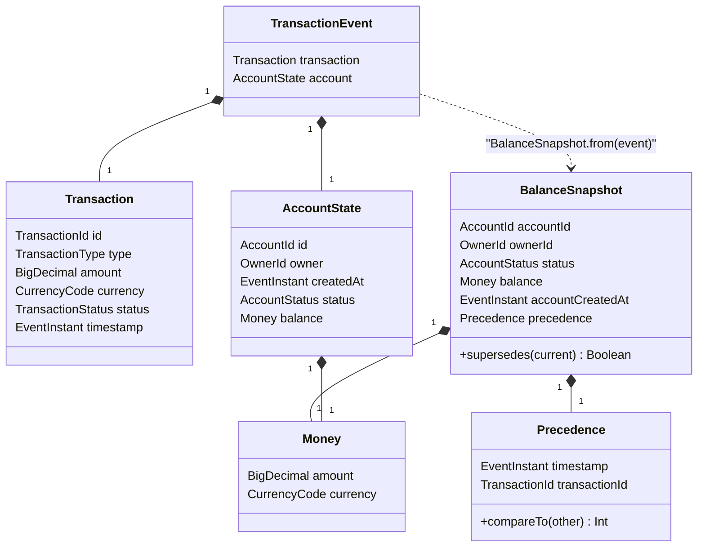
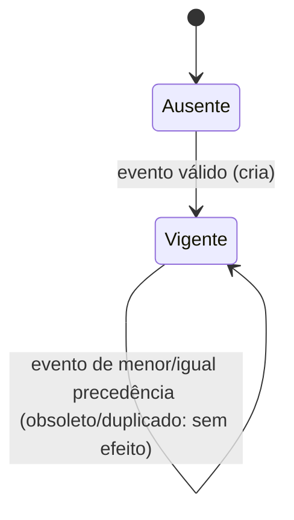

# Data Model: Consulta de Saldo

**Feature**: `001-consulta-saldo` | **Spec**: [spec.md](./spec.md) | **Plano**: [plan.md](./plan.md) | **Decisões**: [research.md](./research.md)

Modelo do bounded context `br.com.itau.challenge.balance`. Identificadores de código em inglês; termos de negócio da
spec entre parênteses. Nada nesta seção depende de Spring, AWS SDK, Kafka ou Jackson: é o conteúdo de `domain`.

## 1. Visão geral



- **Evento de Transação (`TransactionEvent`)**: entrada imutável; unidade de consumo, precedência e idempotência.
- **Saldo/Snapshot (`BalanceSnapshot`)**: no máximo um por conta; é a *única* entidade persistida no DynamoDB e a única
  exposta pela consulta. Nunca é calculado: é a projeção do evento de maior precedência.
- **Mensagem Rejeitada**: não é entidade do domínio nem tem tabela: é o registro no Dead Letter Topic (bytes originais +
  headers), ver `contracts/kafka-events.md` seção 5.
- **Desfecho de Processamento (`ApplyResult` + `RejectionReason`)**: classificação exclusiva de toda mensagem consumida.

## 2. Value objects e invariantes (domínio)

| Tipo | Representação | Invariantes | Violação -> |
|------|---------------|-------------|-------------|
| `AccountId`, `TransactionId`, `OwnerId` | `value class` sobre `String` **canônica em minúsculas** | Regex estrita `8-4-4-4-12` hex (case-insensitive na entrada; normaliza para minúsculas). Não usar `UUID.fromString` (aceita `1-1-1-1-1`) | `invalid_identifier` / API 400 |
| `CurrencyCode` | `String` de 3 letras maiúsculas | Existe em `java.util.Currency.getAvailableCurrencies()` | `invalid_currency` |
| `Money` | `BigDecimal` + `CurrencyCode` | Precisão <= 38 dígitos significativos (limite do `N`); escala positiva <= 38; escala negativa (`1E+3`) é expandida a escala 0 **só se** `precisão - escala <= 38` (sem materializar expoentes gigantes). A precisão é medida por `BigDecimal.precision()` do valor recebido (zeros à direita contam; conservador). Igualdade e `hashCode` por valor numérico (`compareTo == 0`, `stripTrailingZeros()`): `183.10 == 183.1`. Pode ser zero/negativo. **Nunca** `Double`/`Float`. Método de apresentação `withCurrencyFractionDigits()`: `setScale(max(scale, defaultFractionDigits))` se `defaultFractionDigits >= 0` (senão inalterado); **nunca arredonda** | `invalid_value` |
| `EventInstant` | `Long` em microssegundos | Inteiro (`Long`); negativo só para `account.created_at` anterior a 1970 (mínimo 1900-01-01); converte para `Instant` sem perda (`Math.floorDiv/floorMod`, obrigatório com negativos; equivalente a `Instant.ofEpochSecond(µs/1e6, (µs%1e6)*1000)`). O **mínimo depende do papel**, passado na criação: `transaction.timestamp` >= `2000-01-01T00:00:00Z` (detecta s/ms; entra na precedência); `account.created_at` >= `1900-01-01T00:00:00Z` (contas anteriores a 2000 são legítimas; não entra na precedência). Máximo: `agora + tolerância` (application) | `invalid_timestamp` |
| `TransactionType` | `CREDIT`, `DEBIT` | valor exato | `unknown_domain_value` |
| `TransactionStatus` | `APPROVED`, `DECLINED` | valor exato | `unknown_domain_value` |
| `AccountStatus` | `ENABLED`, `DISABLED` | valor exato | `unknown_domain_value` |
| `Transaction.amount` | `BigDecimal` | `>= 0` e mesmas regras de precisão/escala (validado, não persistido) | `invalid_value` |
| `Precedence` | `(EventInstant, TransactionId)` | Ordem total: `timestamp` numérico, depois `transactionId` por **comparação lexicográfica da string canônica** | — |

Onde cada regra é imposta (Constitution IV): o **formato** (JSON, tipos, presença) no adapter `input/kafka`
(parser estrito); as **invariantes de valor** no construtor dos value objects do domínio; a **tolerância de futuro**
na camada `application` (precisa de `Clock`); dados inválidos nunca alcançam a persistência.

### 2.1 Precedência (regra central — FR-003/FR-004)

`candidate` supersede `current` se e somente se

```
candidate.timestamp >  current.timestamp
OR (candidate.timestamp == current.timestamp AND candidate.transactionId > current.transactionId)
```

- Igualdade total (`timestamp` e `transactionId` iguais) = **mesmo evento** -> não supersede -> `duplicate`.
- **Armadilha**: `java.util.UUID.compareTo` compara `long`s *com sinal* e diverge da ordem lexicográfica textual;
  o DynamoDB compara strings por bytes UTF-8. Por isso o desempate é *string canônica em minúsculas* nos dois lados
  (validado: 2000 UUIDs aleatórios, 0 divergências entre `String.compareTo` e a `ConditionExpression`; maiúsculas
  ordenariam antes das minúsculas, logo a normalização é obrigatória).
- O horário de processamento nunca participa (FR-003).

| Snapshot vigente | Evento recebido | Resultado |
|------------------|-----------------|-----------|
| ausente | qualquer válido | `processed` (cria) |
| `(t, A)` | `(t+1, X)` | `processed` |
| `(t, A)` | `(t-1, X)` | `obsolete` |
| `(t, A)` | `(t, B)` com `B > A` | `processed` |
| `(t, B)` | `(t, A)` com `A < B` | `obsolete` |
| `(t, A)` | `(t, A)` | `duplicate` (se conteúdo divergir: `duplicate` + anomalia) |
| `(t, A)` reentregue depois de superado por `(t+1, X)` | `(t, A)` | `obsolete` (indistinguível de qualquer evento antigo sem ledger; ver R-04) |

## 3. Ciclo de vida do snapshot e decisão da consulta



A consulta é função exclusiva do snapshot vigente (FR-011):

| Snapshot vigente | Resposta |
|------------------|----------|
| ausente | 404 `conta-nao-encontrada` |
| status `ENABLED` | 200 `{id, owner, balance{amount,currency}, updated_at}` |
| status `DISABLED` | 409 `conta-desabilitada` (sem saldo/titular/instante) |
| armazenamento indisponível / CB aberto | 503 + `Retry-After` |

DECLINED participa da precedência como qualquer evento (FR-010): não há filtro por `transaction.status`.
`account.created_at` e `transaction.type/amount/status` são validados e consumidos, mas **não persistidos além do
necessário**: persiste-se `accountCreatedAtMicros` (spec: "armazenados/consumidos"); tipo/valor/status da transação
não têm padrão de acesso (YAGNI, Constitution VIII).

## 4. Persistência: tabela DynamoDB `AccountBalances`

### 4.1 Chaves e atributos

| Atributo | Tipo | Papel | Origem |
|----------|------|-------|--------|
| `pk` | S | **Partition key** `ACCOUNT#<accountId minúsculo>` | `account.id` |
| `sk` | S | **Sort key** constante `BALANCE` (reserva o espaço de itens da partição) | — |
| `schemaVersion` | N | Versão do layout do item (`1`), para migrações | — |
| `ownerId` | S | Titular do snapshot | `account.owner` |
| `accountStatus` | S | `ENABLED`/`DISABLED` do snapshot vigente | `account.status` |
| `balanceAmount` | **N** | Decimal exato escrito de `BigDecimal.toPlainString()`; lido com `BigDecimal(String)`. O DynamoDB normaliza zeros à direita (`183.10` -> `183.1`) sem alterar o valor | `account.balance.amount` |
| `balanceCurrency` | S | ISO 4217 | `account.balance.currency` |
| `accountCreatedAtMicros` | N | Criação da conta (µs) | `account.created_at` |
| `lastTxTsMicros` | N | **Chave de precedência, parte 1** (µs, `Long`) | `transaction.timestamp` |
| `lastTxId` | S | **Chave de precedência, parte 2** (UUID canônico minúsculo) | `transaction.id` |

Os nomes evitam termos que colidem com palavras reservadas do DynamoDB (ex.: `owner`, `status`), e as expressões ainda assim usam nomes diretos apenas para atributos seguros.
Item de exemplo (~300 bytes -> 1 WCU/RCU); mesmos valores do seed `infra/dynamodb/account-balances.json` e do smoke test do quickstart seção 3 (`183.10` seria armazenado como `183.1`, ver 4.2):

```json
{
  "pk": {"S": "ACCOUNT#5b19c8b6-0cc4-4c72-a989-0c2ee15fa975"},
  "sk": {"S": "BALANCE"},
  "schemaVersion": {"N": "1"},
  "ownerId": {"S": "315e3cfe-f4af-4cd2-b298-a449e614349a"},
  "accountStatus": {"S": "ENABLED"},
  "balanceAmount": {"N": "183.12"},
  "balanceCurrency": {"S": "BRL"},
  "accountCreatedAtMicros": {"N": "1634874339000000"},
  "lastTxTsMicros": {"N": "1751749453433000"},
  "lastTxId": {"S": "8e8ae808-b154-48b5-9f3e-553935cc4543"}
}
```

Configuração: `PAY_PER_REQUEST` (on-demand; carga de referência de 1.000 ev/s, premissa do autor, é imprevisível e por conta), **sem TTL, sem
GSI, sem streams** (não há requisito). Em produção: PITR habilitado e *deletion protection* (IaC fora do escopo; ver R-17).

### 4.2 `balanceAmount` como `N` (decisão do usuário) e a normalização de zeros (evidência no DynamoDB Local 3.3.0)

| Entrada | Armazenado como `N` (comportamento esperado) |
|---------|----------------------------------------------|
| `183.10` | `183.1` (zeros à direita descartados; **valor idêntico**) |
| `100000000000000000000.00` | `100000000000000000000` |
| 38 dígitos | aceito |
| 39 dígitos | **erro 400** `precision up to 38 digits` (por isso o domínio rejeita > 38 com `invalid_value`, antes do banco) |

- Isso **não é perda**: o valor é exato, e JSON Number não carrega escala (RFC 8259: `183.10` ≡ `183.1`); a origem também envia JSON Number, então a
  escala recebida é artefato do serializador, não informação de negócio. Constitution IV (sem arredondamento nem truncamento de *valor*) é cumprida.
- Na resposta a escala é completada até as casas da moeda, **sem arredondar** (ver 5). Round-trip e formatação são cobertos por teste unitário e de integração.
- `N` mantém o saldo numérico no banco (comparação/agregação futura sem migração).
- Recusadas: **`S` texto plano** (preserva escala que o contrato não garante; dinheiro "stringly typed", não numérico no banco) e **`N` em unidade mínima**
  (exigiria conversão nos dois sentidos, tabela de casas por moeda e rejeitar/arredondar frações de centavo). Ver `research.md` R-06.

### 4.3 Padrões de acesso (e por que não há índice)

| # | Padrão | Operação | Chave | Implementado |
|---|--------|----------|-------|--------------|
| AP1 | Saldo por conta (API) | `GetItem` `ConsistentRead=true` | `pk=ACCOUNT#id, sk=BALANCE` | Sim |
| AP2 | Aplicar evento (ingestão) | `UpdateItem` condicional (upsert) | idem | Sim |
| AP3 | Contas de um titular | `Query` GSI1 (`gsi1pk=OWNER#<owner>`, `gsi1sk=ACCOUNT#<id>`, projeção parcial, esparso) | — | **Não** (sem requisito; evolução) |
| AP4 | Histórico/ledger de transações da conta | `Query` `pk=ACCOUNT#id, sk begins_with TX#` (itens `TX#<ts>#<txId>` com TTL) | mesma partição | **Não** (spec: sem extrato; evolução) |

Toda leitura e escrita implementadas usam a **chave primária**: nenhum índice secundário se justifica (Constitution VIII).
Como o *key schema* de uma tabela é imutável, `pk`/`sk` genéricos com prefixos deixam AP4 (e outros tipos de item)
entrarem depois **sem migração**; é o único motivo do `sk` constante. Ver R-03.

### 4.4 Escrita condicional atômica (concorrência e desordem — FR-006/007/008)

Uma única `UpdateItem` por evento, executada pelo banco, sem leitura prévia:

```text
Key:                 { pk: ACCOUNT#<id>, sk: BALANCE }
UpdateExpression:    SET schemaVersion = :v, ownerId = :o, accountStatus = :st, balanceAmount = :amt,
                         balanceCurrency = :cur, accountCreatedAtMicros = :cr,
                         lastTxTsMicros = :ts, lastTxId = :tx
ConditionExpression: attribute_not_exists(pk)
                     OR lastTxTsMicros < :ts
                     OR (lastTxTsMicros = :ts AND lastTxId < :tx)
ReturnValuesOnConditionCheckFailure: ALL_OLD
```

- Aplicado (`processed`): a condição é verdadeira; todos os campos do snapshot mudam **juntos** (item único atômico:
  a consulta nunca mistura campos de eventos diferentes — FR-013/FR-027).
- `ConditionalCheckFailedException` **não é erro**: o item vigente vem em `exception.item()` (sem leitura extra;
  validado no DynamoDB Local 3.3.0 e no SDK 2.46.7):
  - `lastTxTsMicros == :ts && lastTxId == :tx` -> `duplicate`; se `ownerId`, `accountStatus`, `balanceCurrency` ou
    `balanceAmount` (`compareTo`) divergirem do evento -> anomalia `conflicting_duplicate` (métrica + log), desfecho continua `duplicate`;
  - (nesse caso de conteúdo divergente prevalece o primeiro evento aplicado: não convergente por definição, defeito da origem; ver spec Edge Cases);
  - caso contrário -> `obsolete`;
  - se `hasItem()` for falso (comportamento inesperado do endpoint) -> `GetItem` consistente para classificar (caminho raro, coberto por teste).
- Falhas restantes: throttling/5xx/timeout/conexão -> `BalanceStoreUnavailableException(THROTTLED|UNAVAILABLE|TIMEOUT)` (transitória); `ValidationException`
  -> `BalanceStoreRejectedException` (tratada como não classificada pelo consumer: 3 entregas e DLT `unprocessable_event`).
- Convergência provada: em 400 escritas concorrentes (32 threads, duplicatas e desordem, mesma conta) o vencedor foi
  exatamente `max(timestamp, txId)` (spike); será o teste de integração da seção 7.
- Custo: escrita com condição falsa **ainda consome 1 WCU**; eventos obsoletos custam capacidade. Mitigação (evolução): coalescência por conta no lote (R-09).

### 4.5 Limites, capacidade e hot partition

| Tema | Análise |
|------|---------|
| Item | ~300 B: **1 WCU** por escrita (inclusive condição falsa) e **1 RCU** por leitura forte. 1.000 ev/s ≈ 1.000 WCU/s; 500 consultas/s fortes ≈ 500 RCU/s |
| Distribuição | `pk` = UUID por conta: distribuição uniforme entre partições físicas |
| Hot partition | Limite por chave/partição ≈ 1.000 WCU/s e 3.000 RCU/s (documentação AWS, não revalidada aqui). Uma conta com > ~1.000 eventos/s é irrealista; o gargalo real seria throttling ->`Unavailable`->backpressure (nunca perda) |
| Mitigação futura 1 | Coalescência por conta no lote de consumo (menos escritas; a condição no banco continua a garantia) |
| Mitigação futura 2 | *Write sharding*: `pk=ACCOUNT#id#s<0..N-1>`; leitura faz `BatchGetItem` dos N shards e escolhe a maior precedência (troca escrita por leitura x N). Gatilho: throttling por chave (CloudWatch Contributor Insights) |
| Consistência | Leitura forte (`ConsistentRead=true`, 1 RCU vs 0,5): a consulta reflete a última escrita efetivada (FR-027). Trade-off: 2x custo de leitura e indisponível em partição de rede (vira 503 — preferível a saldo desatualizado, FR-030). Configurável (`DYNAMODB_READ_CONSISTENT`) |

## 5. Mapeamentos sem perda

| Origem | Destino | Regra |
|--------|---------|-------|
| JSON `amount` (`97.07`) | `BigDecimal` | Parse com `USE_BIG_DECIMAL_FOR_FLOATS` (nó `DecimalNode`); string/booleano rejeitados; **nunca** passa por `double` |
| `BigDecimal` | item DynamoDB `N` | `toPlainString()` (sem notação científica); o DynamoDB normaliza zeros à direita (`183.10` -> `183.1`), valor idêntico |
| item DynamoDB `N` | `BigDecimal` | `BigDecimal(String)` (a escala volta normalizada) |
| `Money` | valor apresentado | `setScale(max(scale, Currency.defaultFractionDigits))` quando `defaultFractionDigits >= 0`; nunca arredonda: BRL `183.1` -> `183.10`, `100` -> `100.00`, `10.123` -> `10.123`; JPY `500` -> `500`; XAU (`-1`) inalterado |
| `BigDecimal` | JSON da API | `WRITE_BIGDECIMAL_AS_PLAIN=true` (validado: sem a opção, `1E+3` e `1E-7` saem em notação científica; com ela: `1000`, `0.0000001`, `183.10`); recebe o valor já apresentado |
| `transaction.timestamp` (µs) | `lastTxTsMicros` `N` | `Long` <-> string decimal; sem conversão para `Double` |
| `lastTxTsMicros` | `Instant` -> `updated_at` | `atZone(America/Sao_Paulo)` + `DateTimeFormatter.ISO_OFFSET_DATE_TIME` (validado: `1751749453433000` -> `2025-07-05T18:04:13.433-03:00`, exatamente o exemplo do cliente; `...433123` -> `.433123`; fração some quando zero) |

Fuso de exibição: `America/Sao_Paulo` (config `BALANCE_DISPLAY_ZONE`); o instante (UTC) é a verdade, o offset é apresentação.

## 6. Resultado de aplicação e desfechos

| `ApplyResult` (port `BalanceSnapshotWriter`) | Desfecho (métrica `balance.events{outcome}`) | Log (nível) |
|------|------|------|
| `Applied` | `processed` | INFO |
| `Obsolete` | `obsolete` | DEBUG |
| `Duplicate(conflicting=false)` | `duplicate` | DEBUG |
| `Duplicate(conflicting=true)` | `duplicate` + `balance.events.anomalies` | WARN |
| `InvalidEventException(reason, detail?)` (qualquer camada) | `rejected{reason}` (contado quando o DLT confirma) | WARN |

## 7. Contrato de teste do armazenamento (fake x real)

Uma suíte abstrata `BalanceSnapshotWriterContract` (aplicar/obsoleto/duplicado/empate/anomalia/concorrência) roda contra o
`InMemoryBalanceStore` (unitário, sem infra) **e** contra o `DynamoDbBalanceSnapshotWriter` (integração, DynamoDB Local): o
fake só é confiável porque é verificado contra o banco real. A propriedade de convergência (permutações e duplicações
resultam no mesmo snapshot) roda sobre o fake com 1.000+ casos e sobre o DynamoDB Local com menos casos, ambos com
`seed` fixa e reprodutível.
